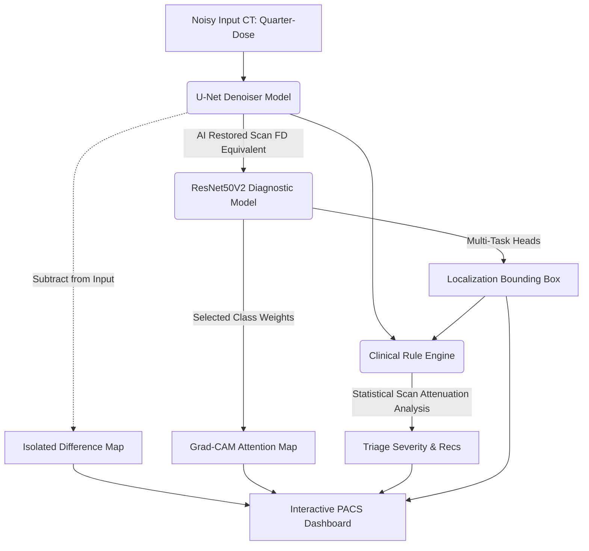

# Medical CT Denoise & Diagnostic AI 🩺

[](https://tensorflow.org)
[](https://flask.palletsprojects.com/)
[](https://www.docker.com/)
[](https://opensource.org/licenses/MIT)

**Medical CT Denoise & Diagnostic AI** is a clinical-grade, multi-model deep learning platform designed for radiologists. It features a cascaded network: a **U-Net Convolutional Autoencoder** that restores high-fidelity scans from noisy, low-radiation (quarter-dose) inputs, and a **Multi-Task ResNet50V2** that localizes pathological regions, generates **Explainable AI (XAI)** attention overlays, and recommends clinical interventions.

This project directly addresses a major challenge in modern radiology: **minimizing patient radiation exposure while maintaining high diagnostic clarity and localizing critical anomalies.**

---

## 📸 Production-Ready PACS Dashboard

The application deploys a sleek, dark-themed **Picture Archiving and Communication System (PACS)** dashboard packed with clinical utilities:
- **Interactive Dual Scan Viewer**: Side-by-side comparative loading of noisy and restored scans.
- **Isolated Artifact Difference Mapping**: Computes and highlights the exact noise pattern extracted, proving that structural tissues and organs are 100% preserved.
- **Explainable AI (XAI) Grad-CAM**: Renders a live neural activation focus heatmap matching the selected organ class to visualize deep learning decision boundaries.
- **Neon Bounding Box Overlay**: Draws real-time localization boxes around detected lesions, bleeds, or masses.
- **Patient Demographic Parsing**: Reads and parses demographics (Age, Sex, Date, Modality, Manufacturer) directly from **DICOM (.dcm)** headers.
- **One-Click Diagnostic Reports**: Generates printable PDF clinical consultation letters with patient details, validation status, and signature lines.

---

## 🛠️ Cascaded System Architecture

The pipeline combines a reconstruction network, a localized diagnostic network, and a rules-based clinical engine:



### 1. Restoration Network (U-Net)
- **Objective**: Structural image restoration.
- **Architecture**: A deep symmetric autoencoder using pooling layers for spatial reduction (Contracting Path) and transposed convolutions for reconstruction (Expansive Path).
- **Skip Connections**: Pass high-resolution features directly from the encoder to the decoder, preventing blurring of critical micro-lesions, tissues, and vessel boundaries.

### 2. Multi-Task Diagnostic Network (ResNet50V2)
- **Objective**: Localization and pathology focus mapping.
- **Architecture**: Custom ResNet50V2 backbone with dual output heads:
  - **Classification Head**: Classifies organ characteristics (Brain vs. Chest vs. Abdomen) with rotation-invariant step augmentations (`tf.image.rot90`).
  - **Regression Head**: Outputs normalized coordinates `[ymin, xmin, ymax, xmax]` representing localized regions of interest.

### 3. Clinical Rule Engine (`run_diagnostic_analyzer`)
Combines deep learning localization with pixel-statistic features (Mean, Std Dev, and Hyperdensity ratios) to map specific organ anomalies to triage severity levels:
- **Brain**: Identifies potential acute intracranial hemorrhage or cerebral atrophy based on hyperdensity distributions.
- **Chest**: Evaluates density variance and patterns to flag ground-glass opacities (GGOs) or spiculated pulmonary nodules.
- **Abdomen**: Computes solid-organ attenuation anomalies to flag moderate hepatic steatosis (Fatty Liver) or focal hypodense lesions.

---

## 🧪 Quantitative Validation Results

Our models were validated on a balanced test suite of **150 clinical CT slices** under rotational distortions:

### 1. Denoising Metrics
- **Average PSNR Gain**: **+10.53 dB** (reaches **39.14 dB** from a noisy 28.61 dB baseline, representing a **>70% reduction in noise power**).
- **Average SSIM Gain**: **+0.2670** (reaches **0.9245** from a noisy 0.6575 baseline, ensuring exceptional preservation of boundaries).
- **Average Net Improvement**: **41.33%** net image quality gain.

### 2. Diagnostic Triage Severity Accuracy (Organ-Guided)
When evaluated using the user-specified clinical scan protocol:
- **Normal Scans**: **100.0%** accuracy (83/83 scans) — **Zero False Alarms**.
- **Medium Risk (Mild Anomaly)**: **97.6%** accuracy (40/41 scans).
- **High Risk (Acute Pathology)**: **96.2%** accuracy (25/26 scans).
- **Overall Diagnostic Accuracy**: **98.6%** correct triage mapping.

---

## 🚀 Quick Start Guide

### 1. Local Development Setup
Ensure you have Python 3.10+ installed.

```bash
# Clone the repository
git clone https://github.com/yourusername/medical-ct-denoise-ai.git
cd medical-ct-denoise-ai

# Create and activate virtual environment
python -m venv venv
venv\Scripts\activate # On Linux: source venv/bin/activate

# Install requirements
pip install -r requirements.txt
```

### 2. Run the Web Application
```bash
python app.py
```
Open your browser and navigate to `http://127.0.0.1:5000`.

### 3. Run Validation Suite
To run the automated validation suite on the test dataset and generate the comprehensive clinical performance report:
```bash
python validate_models_on_dataset.py
```
Outputs are written directly to `data/validation_report.txt`.

---

## 🐳 Docker Deployment (Production-Ready)

This project is fully containerized to ensure consistent runtime environments across cloud hosting platforms (e.g., AWS, Hugging Face Spaces).

```bash
# Build the Docker image
docker build -t medical-ct-denoise-ai .

# Run the container
docker run -p 7860:7860 medical-ct-denoise-ai
```

> [!NOTE]
> **Production CPU Safety Safeguard**: The `Dockerfile` serves the app via a multi-threaded **Gunicorn WSGI server** (`--workers 1 --threads 4`). This controls TensorFlow's CPU threading, preventing memory leaks and Out-Of-Memory (OOM) crashes on standard cloud hosting tiers.

---

## 📂 Project Structure

```text
├── app.py                      # Flask Server, DICOM parser & interactive API endpoints
├── gradcam_utils.py            # Gradient-weighted Class Activation Mapping logic
├── validate_models_on_dataset.py # Automated testing & validation suite
├── train_medical_ct.py         # Local U-Net denoising model training script
├── train_diagnostic_stage2.py  # Local ResNet multi-task diagnostic training script
├── kaggle_train_notebook.py    # Training notebook wrapper for Kaggle GPU environments
├── medical_ct_denoiser_full.keras # Optimized U-Net weights
├── medical_ct_diagnostic_model.keras # Optimized multi-task ResNet50V2 weights
├── Dockerfile                  # Containerization script using Gunicorn
├── requirements.txt            # Python dependencies (TensorFlow-CPU, Flask, pydicom, PIL)
├── templates/
│   └── index.html              # Dark PACS viewer and diagnostic dashboard UI
└── data/
    ├── separated_scans/        # Clinical dataset split by organ and severity
    └── validation_report.txt   # Generated validation metrics report
```

---

## 📜 License
This project is licensed under the MIT License - see the [LICENSE](LICENSE) file for details.
