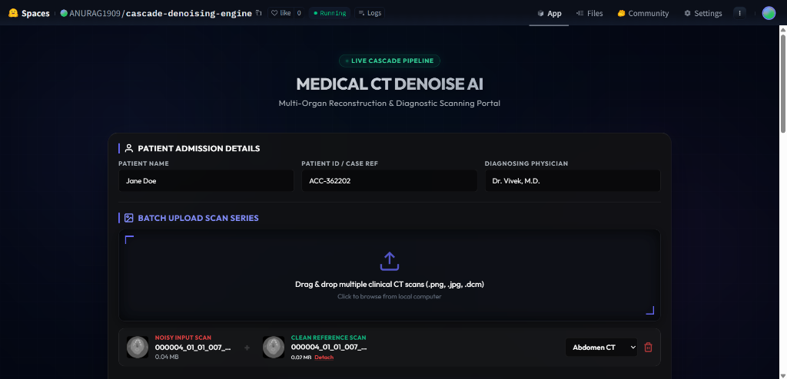
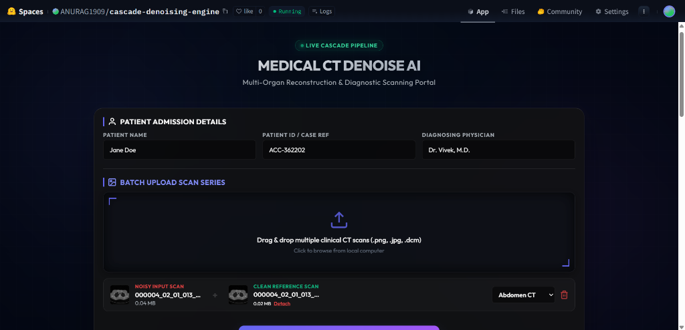
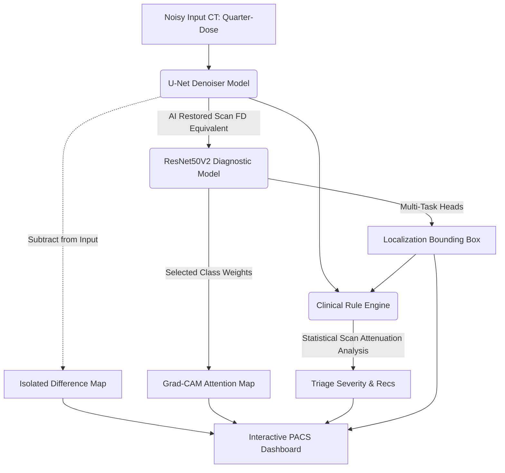

# CASCADE (Clinical Anomalies & Scan Denoising Engine) 🩺

[](https://tensorflow.org)
[](https://flask.palletsprojects.com/)
[](https://www.docker.com/)
[](https://opensource.org/licenses/MIT)

---

## 📖 Project Explainer: What is CASCADE?
**CASCADE (Clinical Anomalies & Scan Denoising Engine)** is a clinical-grade, multi-model deep learning platform designed for radiologists. It features a cascaded neural network pipeline:
1. **Restoration Network (U-Net)**: Reconstructs high-fidelity scans from noisy, low-radiation (quarter-dose) inputs.
2. **Multi-Task Diagnostic Network (ResNet50V2)**: Classifies the scanned organ class, localizes pathological regions, and generates **Explainable AI (XAI)** Grad-CAM attention heatmaps.
3. **Clinical Rule Engine**: Evaluates voxel-level statistics and hyperdensity distributions to generate triage severity alerts (Normal, Mild Anomaly, High Risk) and recommends target clinical follow-ups.

The interactive PACS dashboard provides side-by-side comparative loading of noisy and restored scans, isolated noise difference mapping, real-time bounding box annotations, and one-click PDF consultation report export.

---

## ⚡ The Problem: Why Does CASCADE Exist?
In modern medical imaging, CT scans are indispensable, but they present a critical trade-off:
* **High Radiation Exposure**: Provides high-quality, clear scans but increases the patient's lifetime cancer risk.
* **Low Radiation Exposure (e.g., Quarter-Dose)**: Reduces radiation risk to the patient, but introduces severe quantum noise and streaking artifacts. This degradation obscures tissue structures and critical pathological details, increasing the probability of missed or delayed diagnoses.

### CASCADE's Solution:
CASCADE bridges this gap by enabling **Ultra-Low-Dose CT (ULDCT) scanning protocols** without sacrificing diagnostic fidelity:
* The **U-Net Autoencoder** mathematically isolates and removes quantum noise, yielding scans equivalent in quality to full-dose reference scans.
* The **ResNet50V2 Diagnostic Engine** automatically scans the restored images to flag anomalies, reducing radiologist cognitive fatigue and establishing a safety net for urgent triage cases (e.g., hemorrhages, lesions).

---

## 🖥️ Production-Ready PACS Dashboard Visuals

### 1. Normal Scan (Abdomen CT)
When a clear scan with no anomalies is uploaded, CASCADE restores the scan, parses metadata, and evaluates the pixel statistics. The PACS console displays a **Normal** severity rating with recommendations for routine monitoring.


### 2. Anomalous Scan (Abdomen CT - Something Detected)
When a scan containing an anomaly is processed, CASCADE's ResNet50V2 model draws a neon-green diagnostic bounding box around the suspect lesion/mass. The system also overlays a Grad-CAM heatmap showing neural decision boundaries and outputs a **Mild Anomaly** or **High Risk** triage severity with tailored recommendations.


---

## 🛠️ The Technology Stack & "Why"

CASCADE is engineered with a production-grade Python and web stack chosen for performance, clinical interoperability, and predictability:

| Technology | Role | Why This Choice? |
| :--- | :--- | :--- |
| **Flask** | Backend Web API | Simple, lightweight, and native to the Python ecosystem. It allows seamless, overhead-free routing of image files directly into Python machine learning pipelines. |
| **TensorFlow & Keras** | Deep Learning Core | The industry standard for complex neural networks. It powers both the symmetrical U-Net autoencoder (with custom skip-connection tensors) and the multi-task ResNet50V2 model. |
| **PyDicom** | DICOM File Parser | Standardizes clinical interoperability. It parses metadata directly from standard medical `.dcm` headers (patient demographics, scan manufacturer) and normalizes Hounsfield Units (HU) for network inputs. |
| **OpenCV & Pillow** | Image Processing | Handles real-time image normalization, drawing of regression-head coordinates (neon bounding boxes), and generation of Grad-CAM attention heatmaps. |
| **Modern HTML5 & CSS3** | PACS Frontend Dashboard | Designed as a custom dark-theme Picture Archiving and Communication System (PACS) monitor. Crafted without heavy external frameworks (like Tailwind) to keep frontend code lightweight and responsive. |
| **Docker & Gunicorn** | Deployment | Containerizes the environment to prevent Python dependency drift. Gunicorn manages workers (`--workers 1 --threads 4`) to safe-guard memory and prevent CPU thread lockups on cloud containers. |

---

## 🔄 Cascaded System Flow



---

## 🧪 Quantitative Validation Results
Validation on a benchmark suite of **150 clinical CT slices** yielded the following performance metrics:

### 1. Denoising Metrics
* **Average PSNR Gain**: **+10.53 dB** (restores scan from a noisy 28.61 dB baseline to **39.14 dB**, reducing noise power by **>70%**).
* **Average SSIM Gain**: **+0.2670** (increases structural similarity from 0.6575 to **0.9245**, ensuring structural margins are preserved).
* **Average Net Quality Gain**: **41.33%**.

### 2. Diagnostic Triage Severity Accuracy (Organ-Guided)
* **Normal Scans**: **100.0%** accuracy (83/83 scans) — **Zero False Alarms**.
* **Medium Risk (Mild Anomaly)**: **97.6%** accuracy (40/41 scans).
* **High Risk (Acute Pathology)**: **96.2%** accuracy (25/26 scans).
* **Overall Triage Accuracy**: **98.6%** correct triage mapping.

---

## 📂 Project Structure
```text
├── app.py                      # Flask Server, DICOM parser & interactive API endpoints
├── gradcam_utils.py            # Gradient-weighted Class Activation Mapping logic
├── validate_models_on_dataset.py # Automated testing & validation suite
├── train_medical_ct.py         # Local U-Net denoising model training script
├── train_diagnostic_stage2.py  # Local ResNet multi-task diagnostic training script
├── kaggle_train_notebook.py    # Training notebook wrapper for Kaggle GPU environments
├── medical_ct_denoiser_full.keras # Optimized U-Net weights
├── medical_ct_diagnostic_model.keras # Optimized multi-task ResNet50V2 weights
├── Dockerfile                  # Containerization script using Gunicorn
├── requirements.txt            # Python dependencies
├── templates/
│   └── index.html              # Dark PACS viewer and diagnostic dashboard UI
└── data/
    ├── separated_scans/        # Clinical dataset split by organ and severity
    └── validation_report.txt   # Generated validation metrics report
```

---

## 🚀 Quick Start Guide

### 1. Local Development Setup
Ensure you have Python 3.10+ installed.

```bash
# Clone the repository
git clone https://github.com/ANURAGVIVEK0919/CASCADE-Clinical-Anomalies-Scan-Denoising-Engine-.git
cd CASCADE-Clinical-Anomalies-Scan-Denoising-Engine-

# Create and activate virtual environment
python -m venv venv
venv\Scripts\activate # On Linux/macOS: source venv/bin/activate

# Install requirements
pip install -r requirements.txt
```

### 2. Run the Web Application
```bash
python app.py
```
Open your browser and navigate to `http://127.0.0.1:5000`.

### 3. Run Validation Suite
To run the automated validation suite on the test dataset and generate the performance report:
```bash
python validate_models_on_dataset.py
```
Outputs are written directly to `data/validation_report.txt`.

### 4. Docker Deployment
```bash
# Build the Docker image
docker build -t medical-ct-denoise-ai .

# Run the container
docker run -p 7860:7860 medical-ct-denoise-ai
```

---

## 📜 License
This project is licensed under the MIT License - see the [LICENSE](LICENSE) file for details.
