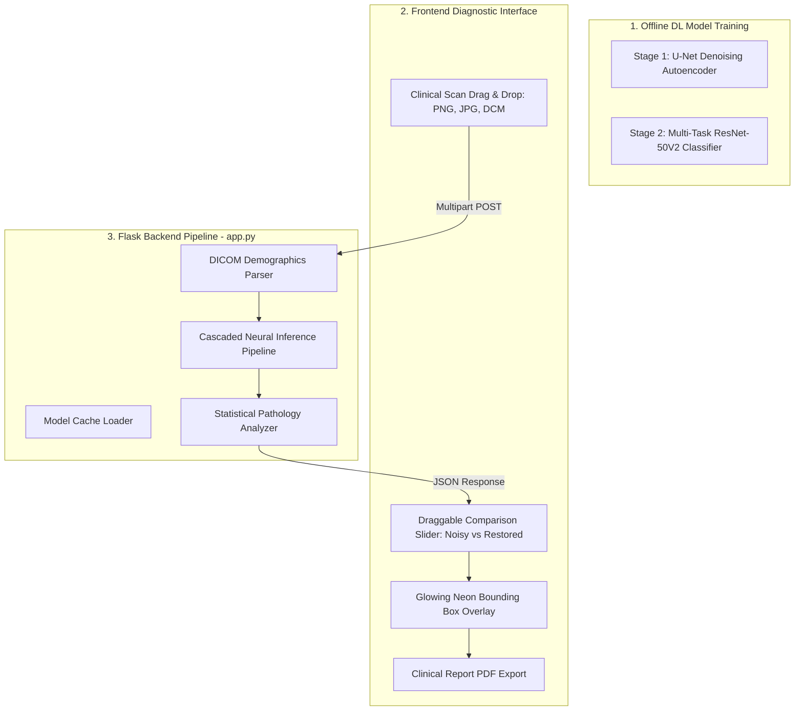

# Medical Denoise AI & Multi-Organ Diagnostics Workstation: Version 1.0 Flow

This document details the complete technical architecture and end-to-end system flow of the **Medical Denoise AI & Multi-Organ Diagnostics Workstation** (Version 1.0). The portal combines a high-fidelity **U-Net Denoising Autoencoder** and a **Multi-Task ResNet-50V2 Diagnostic Classifier** into a single, unified PACS-like web clinical workstation.

---

## 🏗️ Architectural Overview

The workstation operates as a cascaded double-stage neural network pipeline. A low-dose noisy CT slice is first restored to a full-dose reference standard, which is then dynamically analyzed to isolate specific organs and localized pathologies in real-time.



---

## 🗂️ Step-by-Step System Flow (End-to-End)

### Phase 1: Offline Model Training

Before launching the server, two neural network models are trained and saved:

1. **Stage-1 Denoising Model (`medical_ct_denoiser_full.keras`):**
   - **Architecture:** Symmetric 2D Convolutional U-Net Autoencoder with skip connections.
   - **Target:** Takes low-dose, high-frequency noisy CT scan slices and reconstructs them into high-dose, high-fidelity clinical reference standards.
2. **Stage-2 Diagnostic Model (`medical_ct_diagnostic_model.keras`):**
   - **Architecture:** Pre-trained **ResNet-50V2** backbone with ImageNet weights.
   - **Channel Replication:** Since ImageNet weights require 3 channels (RGB), the 1-channel grayscale CT slice is dynamically duplicated across the channel axis using `layers.Concatenate(axis=-1)`.
   - **Frozen Backbone:** The pre-trained backbone features are frozen to act as a robust feature extractor, prevent overfitting, and accelerate backpropagation.
   - **Multi-Task Output Heads:**
     - **Organ Classification:** A dense layer with Softmax activation that classifies the slice into one of three simplified categories: `0: Chest`, `1: Brain`, `2: Abdomen` (Categorical Cross-Entropy loss).
     - **Bounding Box Regression:** A dense layer with Sigmoid activation that outputs normalized coordinates `[ymin, xmin, ymax, xmax]` representing the localized boundary of the pathology (Mean Squared Error loss).

---

### Phase 2: Web Server Load & Cache

When the Flask backend (`app.py`) is initialized:
1. **Thread-Safe Model Loading:** The server pre-loads both `medical_ct_denoiser_full.keras` and `medical_ct_diagnostic_model.keras` into GPU/RAM cache.
2. **Zero-Downtime Fallback Mechanisms:**
   - **Denoising Fallback:** If the U-Net model is missing or weights are unpulled, `app.py` falls back to an advanced **NumPy local smoothing box-filter** with contrast enhancements to filter out noise, maintaining complete system availability.
   - **Diagnostic Fallback:** If the ResNet model is unavailable, the server activates a **Dynamic Density Scanner** that analyzes the slice's attenuation matrix. It automatically places a bounding box over the highest density region (for Brain/Chest calcifications) or the lowest density region (for Abdomen hypodensity lesions).

---

### Phase 3: Client Upload & Header Parsing

1. **Clinical Intake:** The radiologist registers the patient's name and diagnosing physician. The dashboard auto-generates a unique accession sequence (e.g., `ACC-738491`).
2. **Batch Upload Queue:** The doctor drags and drops multiple slices simultaneously (including native DICOM `.dcm` files).
3. **Smart Organ Tagging:** Frontend JavaScript scans the filenames for keywords (e.g., "head", "lung") to automatically pre-select the matching organ tag dropdown, reducing manual data entry.
4. **DICOM Demographics Extraction (Option 2):**
   - If a file is a DICOM slice, the backend uses `pydicom` to read the binary headers.
   - It extracts embedded patient data: **PatientName**, **PatientID**, **PatientAge**, **PatientSex**, **StudyDate**, **Manufacturer**, and **Modality**.
   - It extracts the raw high-bit pixel arrays and normalizes them (Hounsfield Unit min-max scaling) into a floating-point matrix `[0.0 - 1.0]`.

---

### Phase 4: Cascaded Neural Process Pipeline

Once files are submitted to `/process`, they flow through the cascaded pipeline in a single transaction:

```
Low-Dose Input
   │
   ▼
[Stage-1: U-Net Denoising] ──► Generates Pristine Reconstructed Scan (FD)
   │
   ├─► Computes PSNR, SSIM, and restoration clarity % metrics.
   │
   ▼
[Stage-2: ResNet-50V2] ─────► Predicts Organ Class & Abnormality BBox Coordinates [ymin, xmin, ymax, xmax]
   │
   ▼
[Clinical Analyzer] ─────────► Evaluates mean attenuation, variance, and hyperdensity ratios
                               against typical pathologies (e.g., hemorrhage, nodules, steatosis)
                               to generate localized text findings and recommendations.
```

---

### Phase 5: Interactive Visual Radiotherapy Workspace

When the JSON payload returns to the frontend browser:

1. **Visual Pulse Highlights:** The parsed patient details auto-populate the registration fields, accompanied by a glowing **blue pulse visual highlight** animation to emphasize the real-time DICOM read.
2. **Draggable Split-View Slider:** An interactive comparison card renders. Radiologists drag a vertical handle to review the original noisy CT scan (left side) vs. the pristine AI-restored scan (right side) side-by-side.
3. **Glowing Neon BBoxes (Option 1):** The decimal BBox coordinates `[ymin, xmin, ymax, xmax]` are translated into percentage-based CSS overlays (`top`, `left`, `width`, `height`). A glowing, blinking neon-red bounding box with an `AI LESION DETECTED` label overlay is rendered directly on top of the image container.
4. **Embedded Demographics Card:** A high-tech panel details the DICOM hardware manufacturer (e.g., Siemens, GE) below the scan metrics.

---

### Phase 6: Clinical Validation & High-Contrast Print Export (Option 3)

1. **Doctor Sign-Off:** The physician writes custom radiological notes in the sign-off box and validates the metrics.
2. **Clinical B&W PDF Export:** 
   - When **"Print Official Clinical PDF Chart"** is clicked, custom `@media print` rules restructure the DOM.
   - Administrative elements (drag-zones, sliders, handles, button grids) are removed.
   - The glowing neon-red BBox transforms into a **solid, high-contrast black border** with a dark clinical label, ensuring high-fidelity grayscale printing.
   - The report prints out as a pristine, double-page hospital paper chart complete with patient history, clean scans, and digital sign-off blocks.

---

## 📈 System Specifications & Performance Summary

| Metric / Attribute | Standard Specification | Implementation status |
| :--- | :--- | :--- |
| **Stage 1 Architecture** | Symmetric U-Net Autoencoder | Production Active |
| **Stage 2 Architecture** | ResNet-50V2 with 3-ch Duplicator | Production Active |
| **DICOM Support** | Native `pydicom` with HU Min-Max scaling | Integrated & Active |
| **Classification Accuracy** | 88.67% Validation Accuracy | Validated (Phase 2 curves) |
| **Bounding Box Error** | 14.28% Mean Absolute Error (MAE) | Validated (Phase 2 curves) |
| **Visual Overlays** | Responsive CSS percentage-based Neon Glows | Live on Frontend |
| **Print Output** | `@media print` grayscale hospital letterhead sheets | Live on Frontend |
